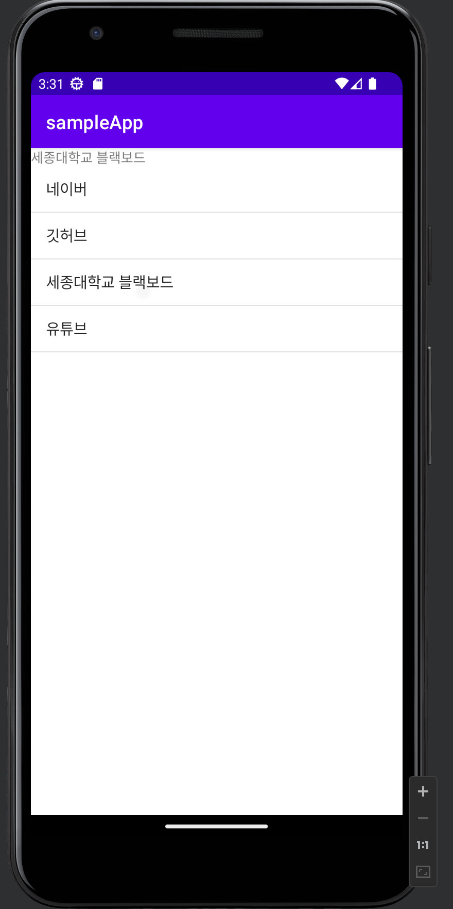
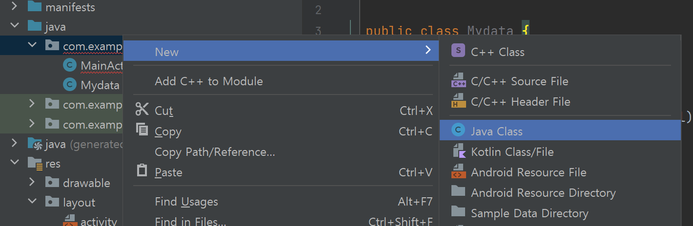
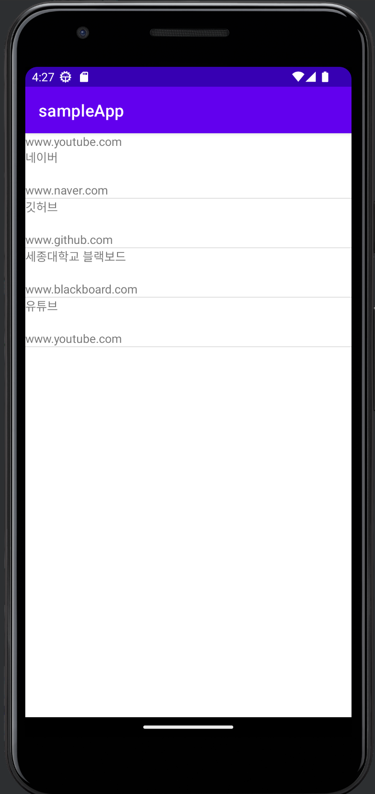

## 5주차 

### 문제상황
신입 앱 개발자로 입사하게 된 나는 첫번째 업무로 북마크 페이지를 만들기로 했다.  
서버에서 북마크 리스트를 넘겨주면 그 리스트로 페이지를 만들고, 페이지 클릭 이벤트로 URL을 연결하면 된다.  
그런데 서버 개발자가 휴가를 가서 당장 데이터를 받을 수 없는 상황이다.  
당장 놀고 있을 수는 없으니 샘플 리스트 페이지를 만들고 서버 작업이 완료될 때 이어 붙여야 겠다고 생각했다.  
북마크 리스트가 출력되고, 북마크를 눌렀을 때 url을 메세지로 띄워주는 화면을 제작하자.  

---

### activity_main.xml
MainActivity 코드는 다음과 같다. 
부모 레이아웃은 LinearLayout, 그 안에는 ListView와 TextView가 존재한다.  
ListView에 각 Item을 클릭했을 때 TextView에 텍스트를 출력하려한다.  
```xml
<?xml version="1.0" encoding="utf-8"?>
<LinearLayout xmlns:android="http://schemas.android.com/apk/res/android"
    xmlns:app="http://schemas.android.com/apk/res-auto"
    xmlns:tools="http://schemas.android.com/tools"
    android:layout_width="match_parent"
    android:layout_height="match_parent"
    android:orientation="vertical"
    tools:context=".MainActivity">

    <TextView
        android:id="@+id/tv_select"
        android:layout_width="match_parent"
        android:layout_height="wrap_content"
        android:text="북마크 클릭시 연결된 URL로 이동합니다." />

    <ListView
        android:id="@+id/listView"
        android:layout_width="match_parent"
        android:layout_height="match_parent" />

</LinearLayout>
```

---

### MainActivity.java
```java
public class MainActivity extends AppCompatActivity {

    @Override
    protected void onCreate(Bundle savedInstanceState) {
        super.onCreate(savedInstanceState);
        setContentView(R.layout.activity_main);

        final TextView tvSelect = findViewById(R.id.tv_select); // TextView 변수 등록
        ListView listView = findViewById(R.id.listView); // ListView 변수 등록

    }
}
```
먼저 Activity에 존재하는 TextView와 ListView를 변수에 등록하여 사용할 수 있도록 해준다.  

```java
public class MainActivity extends AppCompatActivity {

    @Override
    protected void onCreate(Bundle savedInstanceState) {
        super.onCreate(savedInstanceState);
        setContentView(R.layout.activity_main);

        final TextView tvSelect = findViewById(R.id.tv_select); // TextView 변수 등록
        ListView listView = findViewById(R.id.listView); // ListView 변수 등록

        List<String> list = new ArrayList<>(); // String type ArrayList 선언
        list.add("네이버");
        list.add("깃허브");
        list.add("세종대학교 블랙보드");
        list.add("유튜브");
    }
}
```
ArrayList 자료구조를 사용해서 북마크 리스트를 구현한다.  

```java
public class MainActivity extends AppCompatActivity {

    @Override
    protected void onCreate(Bundle savedInstanceState) {
        super.onCreate(savedInstanceState);
        setContentView(R.layout.activity_main);

        final TextView tvSelect = findViewById(R.id.tv_select); // TextView 변수 등록
        ListView listView = findViewById(R.id.listView); // ListView 변수 등록

        // String type ArrayList 선언
        List<String> list = new ArrayList<>(); 
        list.add("네이버");
        list.add("깃허브");
        list.add("세종대학교 블랙보드");
        list.add("유튜브");

        // ArrayAdapter로 어뎁터를 생성
        ArrayAdapter<String> adpater = new ArrayAdapter<String>(this, android.R.layout.simple_list_item_1, list);
        listView.setAdapter(adpater); 
    }
}
```

ArrayAdapter로 어뎁터를 생성 부분은 리스트뷰에 어뎁터를 연결하는 코드이다.  
어뎁터는 쉽게 생각해서 데이터와 리스트뷰 사이를 이어주는 역할이라고 생각하면 된다.  
리스트는 각 아이템이 어떻게 생겼는지만 정의되어 있는데, 어뎁터가 그 정의를 보고 데이터를 리스트에 하나씩 연결해서 그려준다고 생각하면 된다.  

---

```java
public class MainActivity extends AppCompatActivity {

    @Override
    protected void onCreate(Bundle savedInstanceState) {
        super.onCreate(savedInstanceState);
        setContentView(R.layout.activity_main);

        final TextView tvSelect = findViewById(R.id.tv_select); // TextView 변수 등록
        ListView listView = findViewById(R.id.listView); // ListView 변수 등록

        // String type ArrayList 선언
        List<String> list = new ArrayList<>(); 
        list.add("네이버");
        list.add("깃허브");
        list.add("세종대학교 블랙보드");
        list.add("유튜브");

        // ArrayAdapter로 어뎁터를 생성
        ArrayAdapter<String> adpater = new ArrayAdapter<String>(this, android.R.layout.simple_list_item_1, list);
        listView.setAdapter(adpater); 

        // 클릭 이벤트 구현
        listView.setOnItemClickListener(new AdapterView.OnItemClickListener() { 
            @Override
            public void onItemClick(AdapterView<?> adapterView, View view, int position, long l) {
                String data = (String) adapterView.getItemAtPosition(position);
                tvSelect.setText(data);
            }
        });
    }
}
```
클릭 이벤트 구현 부분은 리스트뷰의 아이템을 클릭했을 때 이벤트 처리를 수행하는 코드이다.  
onItemClick 메서드로 전달되는 파라미터를 보면 몇 번째 아이템이 클릭된 것인지를 position 변수 값으로 확인할 수 있다.  
getItemAtPosition 메서드를 통해서 아이템의 데이터를 가져오고 그 데이터를 textView에 그려준다.  

---

### 리스트뷰 구현 흐름 살펴보기 
우리가 리스트뷰를 구현해본 흐름은 다음과 같다.  

1. ListView  가져오기   

2. Data 생성 (ArrayList) // 리스트에 들어갈 데이터  

3. Adapter 생성 (ArrayAdapter) // 리스트를 그려줄 어뎁터  

4. ListView에 Adapter 연결 (setAdapter)  

5. ListView에 Click Event 구현 (setOnItemClickListener)  

---

### 실행 
   
이제 에뮬레이터를 열고 실행해보자. 리스트 아이템을 클릭했을 떄 텍스트가 변하는 것을 확인할 수 있다.

---

### 요구사항
1. 북마크를 눌러서 URL로 이동해야하니 URL을 출력하고 싶은데 텍스트 뷰에 출력되는건 북마크 이름이다.  
2. 북마크 이름 뿐만 아니라 URL도 리스트에서 같이 출력되었으면 한다.   
3. 북마크에 연결되 아이콘도 리스트에서 같이 출력되었으면 한다.   


이 중 1번을 해결해보자. 방금 제작한 간단한 리스트 뷰를 개선해보려한다.
이 문제는 기존 리스트에 "String" 문자열 타입 하나만 들어가기 때문이다.   
단순히 사이트명을 담을 String, 사이트 주소를 담을 String 두개의 String을 포함하는 자료형이면 해결할 수 있다.   

앞선 간단한 리스트 뷰에서는

1. 기본 아이템을 그리는 ListView
2. String 타입의 Array 데이터 생성
3. 이미 정의된 ArrayAdapter 생성
4. ArrayAdapter와 ListView 연결

였다면, 복잡한 리스트 뷰에서는

1. ListView에 들어갈 각각의 ItemView 정의
2. 필요한 Data Class를 정의
3. 우리가 만든 ItemView와 Data에 대한 Adapter 정의
4. 정의한 Adapter를 ListView와 연결

으로 확장된다. 그렇다면,  먼저 `Mydata`라는 자료형을 만들어보겠다.  

  
위 스크린샷처럼 Java 파일을 하나 생성하고, 이름은 MyData로 만든다.  

```java

public class Mydata {
    private String name;
    private String url;

    public Mydata(String name, String url){
        this.name = name;
        this.url = url;
    }
    public String getName()
    {
        return this.name;
    }

    public String getUrl()
    {
        return this.url;
    }
}
```
위와 같이 작성한다.  

커스텀 데이터를 만들었으니, 커스텀 데이터를 담을 커스텀 어뎁터를 만들어야한다. 위와 같은 방식으로 MyAdapter 라는 이름으로 Java 파일을 생성한다.  

```java
public class MyAdapter extends ArrayAdapter<MyData> {

    List<MyData> items;
    Context context;
    public MyAdapter(Context context, int resource, List<MyData> objects) {
        super(context, resource, objects);
        this.context = context;
        this.items = objects;
    }

    public View getView(int position, View convertView, ViewGroup parent) {
        View v=convertView;

        if(v==null)
        {
            LayoutInflater vi=(LayoutInflater)context.getSystemService(Context.LAYOUT_INFLATER_SERVICE);
            v = vi.inflate(R.layout.row,null);
        }

        //데이터 매핑
        final MyData data =items.get(position);

        if(data!=null){
            TextView tv_name=(TextView)v.findViewById(R.id.tv_name);
            TextView tv_url=(TextView)v.findViewById(R.id.tv_url);
            tv_name.setText(data.getName());
            tv_url.setText(data.getUrl());
        }
        return v;
    }
}
```
위와 같이 코드를 작성한다. 당장 커스텀 Adapter를 이해하지 못해도 좋다. 

```java
        // String type ArrayList 선언
        List<String> list = new ArrayList<>(); 
        list.add("네이버");
        list.add("깃허브");
        list.add("세종대학교 블랙보드");
        list.add("유튜브");
```
다시 MainActivity.java로 돌아와 위 코드를 아래와 같이 변경한다.  

```java
List<Mydata> list = new ArrayList<Mydata>();
        list.add(new Mydata("네이버","www.naver.com"));
        list.add(new Mydata("깃허브","www.github.com"));
        list.add(new Mydata("세종대학교 블랙보드","www.blackboard.com"));
        list.add(new Mydata("유튜브","www.youtube.com"));
```

```java
        ArrayAdapter<String> adpater = new ArrayAdapter<String>(this, android.R.layout.simple_list_item_1, list);
        listView.setAdapter(adpater);
```
위 코드도 마찬가지로 아래와 같이 변경한다.  
```java
        MyAdapter adpater = new MyAdapter(this,0, list);
        listView.setAdapter(adpater);
```

---
### 실행 
   
이제 에뮬레이터를 열고 다시 실행해보자. 리스트 아이템을 클릭했을 떄 텍스트가 사이트 이름에서 사이트 url로 잘 출력된다.  


### 5주차 과제
4주차 과제는 위 과정을 잘 따라한 뒤 에뮬레이터 스크린샷을 찍어서 4주차 폴더에 `5주차_과제_이름.png` 형식으로 제출한다.

---

감사합니다😉


### Reference

https://bbaktaeho-95.tistory.com/66
https://lktprogrammer.tistory.com/163 


