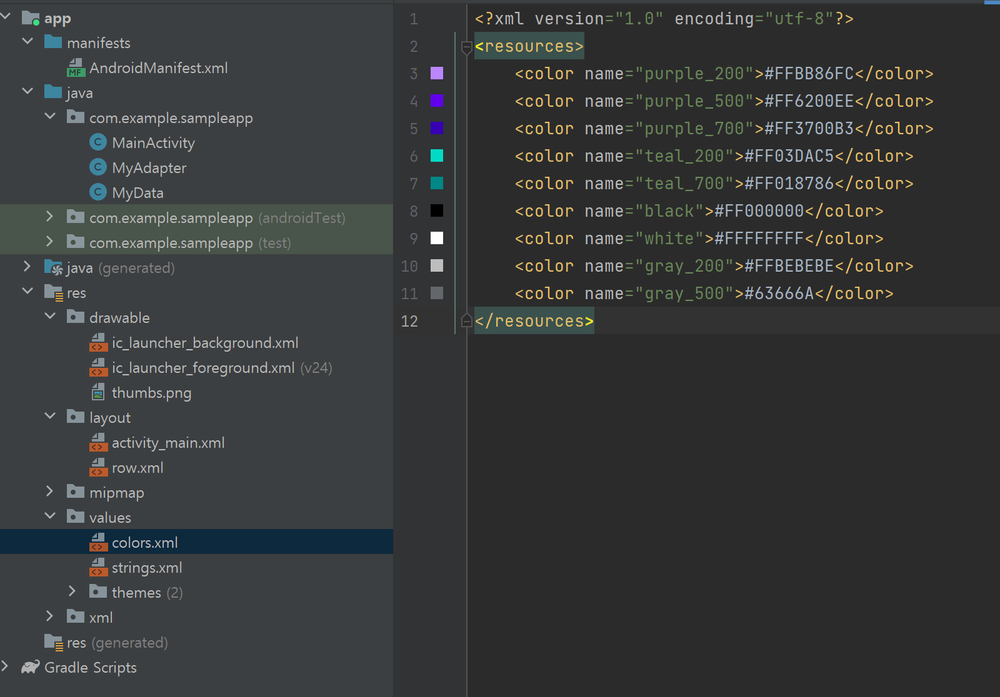
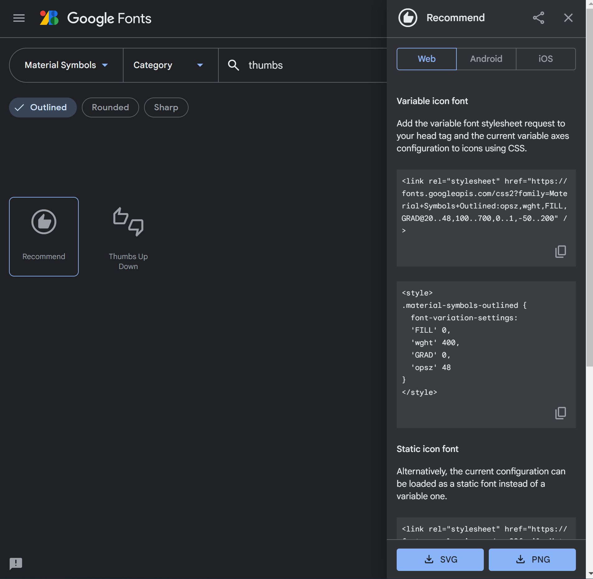
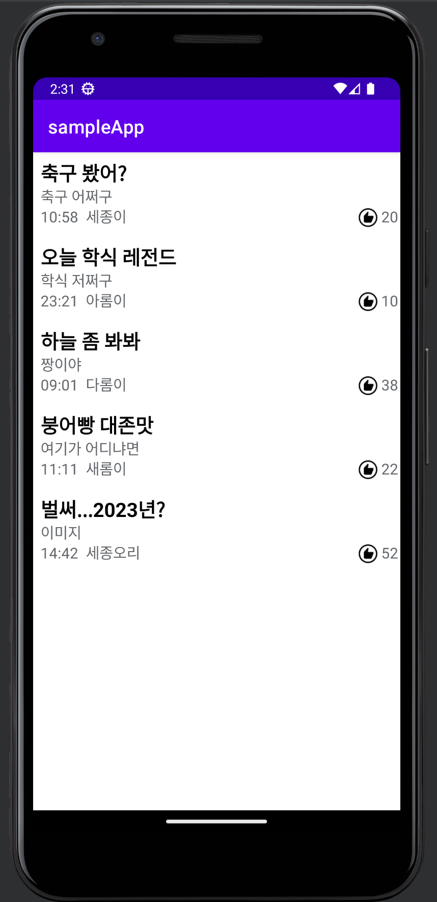

## 6주차 

### 리스트 뷰 -> 리사이클러 뷰 개선작업  

이번 주차는 저번 주에 만들었던 리스트 뷰를 개선하는 작업을 해볼 생각이다.  
RecyclerView 는 ListView 보다 향상된 성능을 제공한다.  
ListView는 스크롤 할 때마다 위에 있는 뷰가 삭제되고 맨 아래 뷰가 생성되는 반면,  
RecyclerView는 위에 있는 뷰를 아래로 이동시켜 재사용한다. (그래서 RecyclerView이다.)

---

### color  

   
먼저 위 스크린샷 처럼 values에 colors.xml에 들어가 gray 색상을 정의해준다.  
위 처럼 `gray_200`, `gray_500`과 네이밍을 하는 이유는  
1. 같은 색이여도 더 연하고 짙은 색으로 구분하기 위해  
2. 중간 정도의 색을 추가할 때를 대비하여 충분히 큰 값이면 유연하게 대응할 수 있어서  
(gray_2, gray_5로 변수명을 짓는다면 중간 색상은 3,4로만 사용 가능하다.)  
  
---

### icon  

   
다음은 아래 링크에 들어가서 엄지 아이콘을 .png 파일로 다운받는다.  
https://fonts.google.com/icons?icon.query=thumbs&icon.platform=web   
파일명을 `thumbs.png`로 변경하고, `res/drawable` 아래에 붙여넣는다.  
(파일탐색기에서 파일을 Ctrl+C하고 안드로이드 스튜디오 drawable 폴더 선택한 채로 Ctrl+V 하면 붙여넣기 가능하다.)  
  
---

### activity_main.xml  

MainActivity 코드는 다음과 같다. 
부모 레이아웃은 LinearLayout(vertical), 그 안에는 RecyclerView를 두어 세로로 View가 쌓이도록 구성했다.  
```xml
<?xml version="1.0" encoding="utf-8"?>
<LinearLayout xmlns:android="http://schemas.android.com/apk/res/android"
    xmlns:tools="http://schemas.android.com/tools"
    xmlns:app="http://schemas.android.com/apk/res-auto"
    android:orientation="vertical"
    android:layout_width="match_parent"
    android:layout_height="match_parent"
    tools:context=".MainActivity">

    <androidx.recyclerview.widget.RecyclerView
        android:id="@+id/recyclerView"
        android:layout_width="match_parent"
        android:layout_height="match_parent" />
</LinearLayout>
```

---

### row.xml  

RecyclerView에 사용될 각 View가 어떤 모양으로 생성될 지를 정의한다.  
마치 게시판 목록과 같은 형태로 제작될 것이다.  
```xml
<?xml version="1.0" encoding="utf-8"?>
<LinearLayout xmlns:android="http://schemas.android.com/apk/res/android"
    xmlns:tools="http://schemas.android.com/tools"
    android:orientation="vertical"
    android:layout_width="match_parent"
    android:layout_height="wrap_content"
    android:id="@+id/item_row">

    <TextView
        android:id="@+id/item_board_title"
        android:layout_width="match_parent"
        android:layout_height="wrap_content"
        android:layout_marginTop="8sp"
        android:layout_marginLeft="8sp"
        android:textSize="21sp"
        android:textStyle="bold"
        android:textColor="@color/black"
        tools:text="TITLE" />

    <TextView
        android:id="@+id/item_board_content"
        android:layout_width="match_parent"
        android:layout_height="wrap_content"
        android:textColor="@color/gray_500"
        android:textSize="16sp"
        android:layout_marginLeft="8sp"
        android:maxLines="1"
        android:ellipsize="end"
        tools:text="Contents" />

    <LinearLayout
        android:layout_width="wrap_content"
        android:layout_height="wrap_content"
        android:layout_marginBottom="8sp"
        android:orientation="horizontal">

        <TextView
            android:id="@+id/item_board_time"
            android:layout_width="match_parent"
            android:layout_height="wrap_content"
            android:layout_marginLeft="8dp"
            android:textColor="@color/gray_500"
            android:textSize="16sp"
            tools:text="Time" />

        <TextView
            android:id="@+id/item_board_writer"
            android:layout_width="wrap_content"
            android:layout_height="wrap_content"
            android:layout_marginLeft="8dp"
            android:textColor="@color/gray_500"
            android:textSize="16sp"
            tools:text="Writer" />

        <View
            android:layout_width="0dp"
            android:layout_height="0dp"
            android:layout_weight="1" />

        <ImageView
            android:layout_width="24dp"
            android:layout_height="24dp"
            android:layout_gravity="center"
            android:src="@drawable/thumbs" />

        <TextView
            android:id="@+id/item_board_like"
            android:layout_width="wrap_content"
            android:layout_height="wrap_content"
            android:layout_marginLeft="2dp"
            android:layout_marginRight="2dp"
            android:textColor="@color/gray_500"
            android:textSize="16sp"
            tools:text="10" />

    </LinearLayout>

</LinearLayout>
```

---

### MyData  

View가 바뀌었으니 View에 필요한 데이터 구성도 변경되었다.  
각 View는 제목, 내용, 시간, 글쓴이, 좋아요 수를 필요로 한다.  
MyData도 아래와 같이 수정해주면 되겠다.  
```java

public class MyData {

    private String title;
    private String contents;
    private String time;
    private String writer;
    private int like;

    public MyData(String title, String contents, String time, String writer, int like){
        this.title=title;
        this.contents=contents;
        this.time=time;
        this.writer=writer;
        this.like=like;
    }

    public String getTitle() {
        return title;
    }

    public void setTitle(String title) {
        this.title = title;
    }

    public String getContents() {
        return contents;
    }

    public void setContents(String contents) {
        this.contents = contents;
    }

    public String getTime() {
        return time;
    }

    public void setTime(String time) {
        this.time = time;
    }

    public String getWriter() {
        return writer;
    }

    public void setWriter(String writer) {
        this.writer = writer;
    }

    public int getLike(){
        return like;
    }

    public void setLike(int like){
        this.like = like;
    }
}
```

---

### MyAdapter  

Mydata가 준비되었다면 ViewHolder를 상속받는 MyAdapter를 만들어주면 된다.   
Adapter에서 ViewHolder를 사용하는 이유는?  
맨 처음 화면에 보이는 뷰 객체를 홀딩(기억)하고 있어야 하기 때문에 ViewHolder를 사용한다.  
```java
public class MyAdapter extends RecyclerView.Adapter<MyAdapter.MyViewHolder> {
    // 해당 어댑터의 ViewHolder를 상속받는다.
    private List<MyData> datas;

    public MyAdapter(List<MyData> datas) {
        this.datas = datas;
    }

    @Override
    public MyViewHolder onCreateViewHolder(@NonNull ViewGroup parent, int viewType) {
        // ViewHodler 객체를 생성 후 리턴한다.
        return new MyViewHolder(LayoutInflater.from(parent.getContext()).inflate(R.layout.row, parent, false));
    }

    @Override
    public void onBindViewHolder(@NonNull MyViewHolder holder, int position) {
        // ViewHolder 가 재활용 될 때 사용되는 메소드
        MyData data = datas.get(position);
        holder.title.setText(data.getTitle());
        holder.contents.setText(data.getContents());
        holder.time.setText(data.getTime());
        holder.writer.setText(data.getWriter());
        holder.like.setText(Integer.toString(data.getLike())); // int to string
    }

    @Override
    public int getItemCount() {
        return datas.size(); // 전체 데이터의 개수 조회
    }

    // 아이템 뷰를 저장하는 클래스
    public class MyViewHolder extends RecyclerView.ViewHolder {
        // ViewHolder 에 필요한 데이터들을 적음.
        private TextView title;
        private TextView contents;
        private TextView time;
        private TextView writer;
        private TextView like;

        public MyViewHolder(@NonNull View itemView) {
            super(itemView);
            // 아이템 뷰에 필요한 View
            title = itemView.findViewById(R.id.item_board_title);
            contents = itemView.findViewById(R.id.item_board_content);
            time = itemView.findViewById(R.id.item_board_time);
            writer = itemView.findViewById(R.id.item_board_writer);
            like = itemView.findViewById(R.id.item_board_like);
        }
    }
}
```

---

### MainActivity.java  

이제 MainActivity.java에서 Recyclerview와 Adapter, Mydata를 각각 선언하고 연결해주면 끝이다.  
아래처럼 더미 데이터를 생성해서 만들어주었다.  
```java
public class MainActivity extends AppCompatActivity {
    private RecyclerView mPostRecyclerView;
    private MyAdapter mAdpater;
    private List<MyData> mDatas;

    @Override
    protected void onCreate(Bundle savedInstanceState) {
        super.onCreate(savedInstanceState);
        setContentView(R.layout.activity_main);

        mPostRecyclerView = findViewById(R.id.recyclerView);
        mDatas = new ArrayList<>(); // 더미 데이터 추가
        mDatas.add(new MyData("축구 봤어?","축구 어쩌구","10:58", "세종이",20));
        mDatas.add(new MyData("오늘 학식 레전드","학식 저쩌구","23:21","아롬이",10));
        mDatas.add(new MyData("하늘 좀 봐봐","짱이야","09:01","다롬이",38));
        mDatas.add(new MyData("붕어빵 대존맛","여기가 어디냐면","11:11","새롬이",22));
        mDatas.add(new MyData("벌써...2023년?","이미지","14:42","세종오리",52));

        // Adapter, LayoutManager 연결
        mAdpater = new MyAdapter(mDatas);
        mPostRecyclerView.setAdapter(mAdpater);
        mPostRecyclerView.setLayoutManager(new LinearLayoutManager(this));
    }
}
```

---

### 실행  
   
이제 에뮬레이터를 열고 실행해보자.  
우리가 만든 게시판 형태의 리사이클러 뷰가 잘 보인다. 
더 많은 데이터를 넣으면 스크롤도 가능하다.  

---

### 6주차 과제  
6주차 과제는 위 과정을 잘 따라한 뒤 에뮬레이터 스크린샷을 찍어서 6주차 폴더에 `6주차_과제_이름.png` 형식으로 제출한다.

---

감사합니다😉

### Reference
(*아래 블로그를 재구성하여 제작하였습니다. 참고하시면 큰 도움 되실 것 같습니다.*)
[RecyclerView에 대해 알아보자! ｜ Android Study](https://velog.io/@hoyaho/RecyclerView)  
[RecyclerView - 안드로이드 공식문서](https://developer.android.com/guide/topics/ui/layout/recyclerview?hl=ko)  
